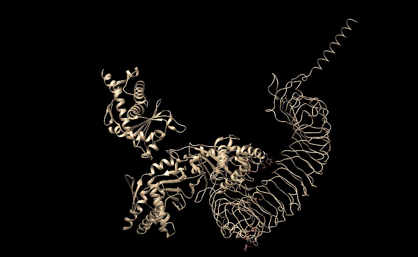
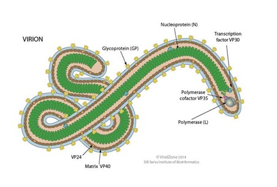
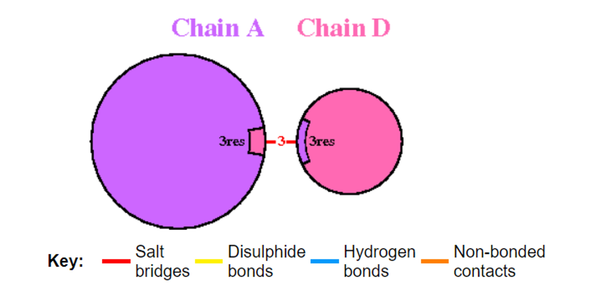
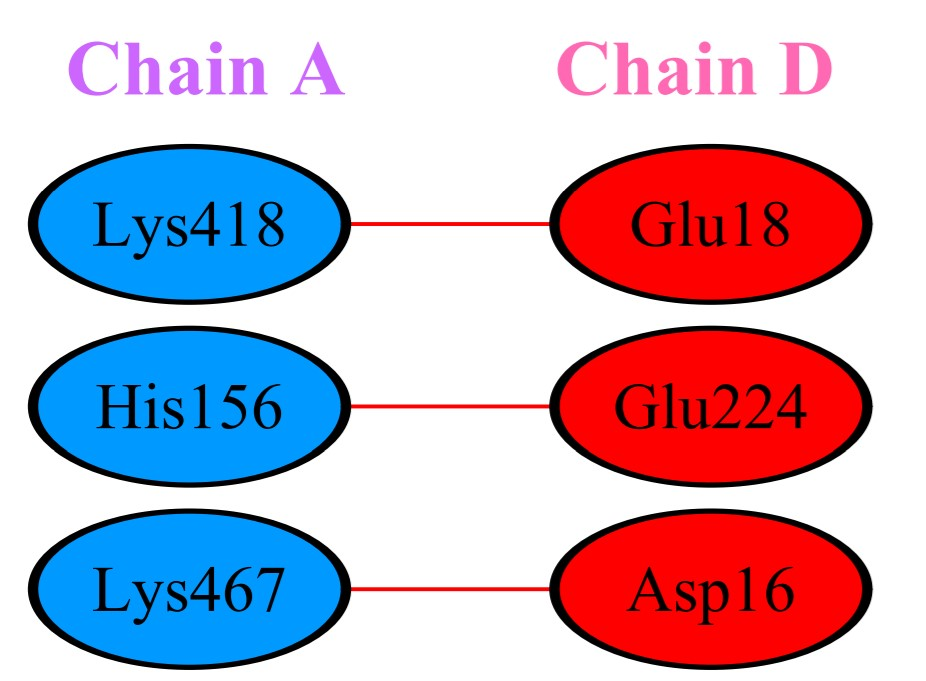
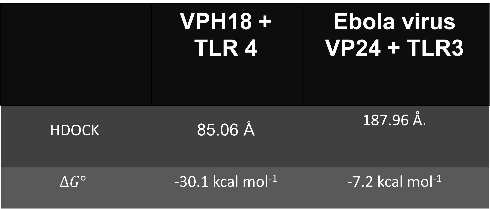

## TLR vs VPH y Ebola 

### Introducción

Desde tiempos antiguos nuestro cuerpo ha luchado por evolucionar y adaptarse a distintas situaciones de riesgo, y esto se intensifica más cuando se debe enfrentar contra algún tipo de patógeno tales como los virus. Puede ser algo complejo entender cómo el cuerpo humano puede darle batalla a estos antígenos que pueden perdurar por años, sin embargo, gracias al avance tecnológico y científico es posible darle una ayuda al sistema inmunitario humano para acelerar el proceso de protección contra estos virus. 

El tercer Objetivo de Desarrollo Sostenible (ODS) está focalizado a la salud y bienestar, el cual busca garantizar una vida sana y promover el bienestar para todos en todas las edades. Es en este objetivo que se inspiró para realizar este Club de ciencia llamado “Virus o anticuerpos, quién se adapta más rápido y cómo”, ya que lo que se busca por medio de investigación y desarrollo en el ámbito médico, disminuir la mortalidad por los virus tan agresivos como el que hoy en día estamos luchando por erradicar (SARS-CoV-2).

Con la ayuda del análisis computacional y la biología, se tomaron como ejemplos al VPH (Virus del Papiloma Humano) y al virus del Ébola para entender cómo los anticuerpos nos protegen contra los virus.

### Métodología

A.	Como primer paso, se eligieron estas dos proteínas de la base de datos “Protein Data Bank (PDB)”:
  1.	Estructura del pentámero de la proteína principal de la cápside L1 del virus del papiloma humano tipo 18. ID PDB: 2R5I.
  
 Las siglas VPH significan virus del papiloma humano (HPV, por sus siglas en inglés). El VPH se conforma por un grupo numeroso de virus relacionados. 
A cada variedad de virus en el grupo se le asigna un número, lo que es llamado tipo de VPH. 
Los tipos comunes de VPH de alto riesgo incluyen los tipos 16 y 18 del virus.

   2.	Virus del Ébola VP24 (EBOV) en complejo con carioferina alfa 5 C-terminal. ID PDB: 4U2X.
 La proteína viral del Ébola se considera una proteína de matriz secundaria multifuncional presente en partículas virales. 
En el centro de la desregulación inducida por el Ébola se encuentra una temprana y coordinada actuación de las proteínas VP24, VP30 y VP35, que conduce a niveles elevados de replicación viral, a una inapropiada temporización de la cascada de liberación de linfocinas y a la muerte, tanto de células presentadoras de antígenos, como de células efectoras.

B.	Al reconocer el ID en el que los virus se identifican en la página “RCSB PDB”, se dispone a utilizar el programa “Chimera”, el cual nos ayudará a limpiar la estructura de cada uno para dejar solamente la proteína del virus. 

C.	Se procede a elegir qué receptores tipo toll (TLRs, por sus siglas en inglés) se utilizarán para acoplarlos en la proteína de los virus. Éstos son sensores de reconocimiento de membrana evolutivamente conservados, constituyen una familia de proteínas que forman parte del sistema inmunitario innato. Podría decirse que son activadores clave de la respuesta inmunológica. Sin embargo, se debe elegir cuidadosamente ya que cada TLR tiene ciertas características que los hace más afines a ciertas proteínas de virus. 

### VPH tipo 18 + TLR 4

``

``

Un estudio realizado por Hasimu A. y otros (2) evidenció que la expresión de TLR4, 7 y 9 varía significativamente en el tejido de cáncer cervical, donde los niveles de expresión de TLR4 y TLR9 correlacionaron positivamente con la infección del VPH16 y VPH18.
Como el TLR 4 es un TLR de membrana celular, es adecuado para que se acople con la proteína principal de la cápside L1 del virus del papiloma humano tipo 18.
TLR4 reconoce el lipopolisacárido (LPS) de la pared de bacterias Gram negativas, las proteínas de choque térmico (HSP) de 60 y 70 kDa, entre otros.

#### Virus del Ébola + TLR3 

``

Los TLR de membrana endosomal van a reconocer moléculas intracelulares, como el TLR-3 que reconoce ARN BC (ARN bicatenario).
Aunque el virus del ébola contiene ARN monocatenario se quiere averiguar si existe alguna posibilidad de compatibilidad.

D.	Con la ayuda de la página de internet “HDOCK SERVER”, el cual acopla a la proteína y el TLR basado en un algoritmo híbrido de modelado. A este proceso se conoce como “Docking o acoplamiento molecular”, el cual predice la conformación preferida de una molécula, con el objetivo de formar un complejo estable. El modelo 1 es el que normalmente es el que demuestra una conformación más estable. 

E.	Ya que se ha elegido el modelo que supuestamente es de una conformación más estable, se procede a conocer el valor de la ΔG (energía libre de Gibbs), el cual nos indicará que tiene mucha afinidad si presenta un valor negativo. Esto se realiza en la página de internet “PRODIGY (PROtein binDIng enerGY prediction)”.

F.	Y como último paso, se procede a utilizar la página de internet “PDB SUM”, para conocer el número de enlaces que se forman entre la proteína y el TLR de cada uno de los virus que se han elegido y la forma en la que éstos se encuentran (enlaces aminoácido – aminoácido).

### Resultados

### VPH tipo 18 + TLR 4

``

``

Se evaluó la afinidad de la VPH18 y el TLR4 para conocer si es recomendable para realizar algún tipo de vacuna contra este virus.  

De la página de “HDOCK” se tomará en cuenta los valores de “ligando rmsd (Å), mientras más pequeño sea el valor será mejor. 
El modelo 1 muestra un valor de ligando rmsd de 85.06 Å. 
En la página de PRODIGY se obtuvo una energía libre de Gibbs de -30.1, mostrando que el VPH18 y el TLR4 tienen buena afinidad.

#### Virus del Ébola + TLR3

Se evaluó la afinidad del virus del ébola y el TLR3 para conocer si es recomendable para realizar algún tipo de vacuna contra este virus. 
De la página de “HDOCK” se tomará en cuenta los valores de “ligando rmsd (Å), mientras más pequeño sea el valor será mejor. 
El modelo 9 muestra un valor de ligando rmsd de 187.96 Å.
En la página de PRODIGY se obtuvo una energía libre de Gibbs de -7.2 kcal mol-1, mostrando que el VPH18 y el TLR4 tienen muy poca afinidad.

### Conclusiones

Se pudo observar las interacciones que tienen el VPH18 con el TLR4 y el del virus del Ébola con el TLR3. Se obtuvieron resultados favorables en el Decking que se hizo entre el VPH18 y el TLR4, mostrando que pudiese tener reacciones positivas en el tratamiento de este virus, basándonos en que como la proteína principal de la cápside L1 del virus se encuentra en el exterior y justamente el TLR4 es un receptor de membrana celular. 
Pero sucede todo lo contrario con el acoplamiento molecular entre el Virus del Ébola VP24 y el TLR3, ya que a pesar de que este receptor es de reconocimiento de moléculas intracelulares. Se fundamenta que la conformación formada por ambos no es estable debido a que el TL3 reconoce ARN bicatenario y el virus del ébola consiste en ARN monocatenario.
Se podría seguir haciendo varias pruebas con ayuda de todas estas plataformas digitales para seguir aprendiendo de las interacciones de estos acoplamientos moleculares y llegar a conformaciones estables que ayuden en el desarrollo de vacunas para mejorar al sistema inmunitario.

### BIBLIOGRAFÍA
1.	Arribillaga L, Echeverria I, Belsue V, Gomez T, Lozano T, Casares N, Villanueva L, Domingos-Pereira S, Romero PJ, Nardelli-Haefliger D, Hervás-Stubbs S, Sarobe P, Rodriguez MJ, Carrascosa JL, Zürcher T, Lasarte JJ. Bivalent therapeutic vaccine against HPV16/18 genotypes consisting of a fusion protein between the extra domain A from human fibronectin and HPV16/18 E7 viral antigens. J Immunother Cancer. 2020 Jun;8(1):e000704. doi: 10.1136/jitc-2020-000704. PMID: 32581060; PMCID: PMC7319778.
2.	Heredia Ruíz, D., Herrera Martínez, C., & Fernández Caraballo, D. (2019). Vías de señalización celular implicadas en la carcinogénesis cervical. Revista Cubana de Obstetricia y Ginecología, 45(3). Recuperado de http://www.revginecobstetricia.sld.cu/index.php/gin/article/view/491/410
3.	Durán, Anyelo, Álvarez-Mon, Melchor, & Valero, Nereida. (2014). Papel de los receptores tipo toll (TLRs) y receptores para dominios de oligomerización para la unión a nucleótidos (NLRs) en las infecciones virales. Investigación Clínica, 55(1), 61-81. Recuperado en 20 de agosto de 2021, de http://ve.scielo.org/scielo.php?script=sci_arttext&pid=S0535-51332014000100008&lng=es&tlng=es.
4.	Betancourt Álvarez, Pablo Ricardo, Luján Risco, Yusimy, Ramírez Zayas, Roger, & Calderín Marín, Osaida. (2015). Ébolavirus: biología molecular y evasión de la respuesta inmune. Revista Cubana de Hematología, Inmunología y Hemoterapia, 31(4) Recuperado en 20 de agosto de 2021, de http://scielo.sld.cu/scielo.php?script=sci_arttext&pid=S0864-02892015000400005&lng=es&tlng=es.
5.	Santos-López, G., Márquez-Domínguez, L., Reyes-Leyva, J., & Vallejo-Ruiz, V. (2015). Aspectos generales de la estructura, la clasificación y la replicación del virus del papiloma humano. Revista Médica del Instituto Mexicano del Seguro Social, 53(S2), 166-171.
6.	Heredia Ruíz, D., Herrera Martínez, C. M., & Fernández Caraballo, D. (2019). Vías de señalización celular implicadas en la carcinogénesis cervical. Revista Cubana de Obstetricia y Ginecología, 45(3).

### Video

<iframe width="560" height="315" src="https://www.youtube.com/embed/ylZTZl0PbiQ" title="YouTube video player" frameborder="0" allow="accelerometer; autoplay; clipboard-write; encrypted-media; gyroscope; picture-in-picture" allowfullscreen></iframe>

 1. Para insertar un video de YouTube, en la página de YouTube del video selecciona compartir y selecciona el código de html.
 <iframe width="560" height="315" src="https://www.youtube.com/embed/PLj1-CMNERM" title="YouTube video player" frameborder="0" allow="accelerometer; autoplay; clipboard-write; encrypted-media; gyroscope; picture-in-picture" allowfullscreen></iframe>
 
 2. Insertar el link de tu video en YouTube, [nuestro video](https://youtu.be/rmXvlBPq24Q).
 4. Puedes subir el archivo de tu video directamente a Github [instrucciones aquí](https://stackoverflow.com/questions/4279611/how-to-embed-a-video-into-github-readme-md)
 
### Equipo:

* Leonardo Darwin Ortiz Perez
* Ileany Noemi Avila Chay
* Jennifer Evelyn Estrada Medina

